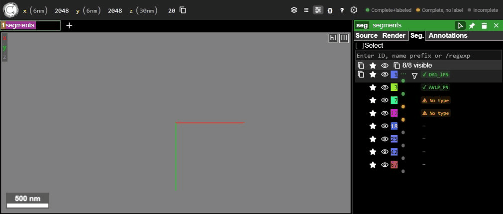

# ng-extend — Eyewire II Community Edition

A [neuroglancer](https://github.com/google/neuroglancer) viewer with community proofreading features built on top of the [CAVE](https://github.com/CAVEconnectome) annotation framework.



---

## Features

### Status pip indicators
Every segment in the list shows a small coloured dot reflecting its proofreading state — always visible, not just on hover.

| Pip colour | Meaning |
|---|---|
| 🟢 Green | Complete and cell type labelled |
| 🟠 Amber | Marked complete, no cell type yet |
| ⚫ Grey | Not yet marked complete |

A **legend** is displayed in the top bar next to the neuroglancer layer tabs so the colours are always explained in context.

### Label column badges
The segment name cell is augmented to show the cell type inline:

- `✓ DA1_lPN` — complete, labelled (green)
- `⚠ No type` — complete, no label (amber)
- `—` — incomplete (grey)

The native neuroglancer segment list layout (star, eye, colour box, ID) is fully preserved; these are additive decorations only.

### Completion & cell-type workflow
Clicking the `⋯` button on any segment row opens a context menu to:
- Toggle **Mark Complete / Unmark Complete**
- Set or update the **cell type** (preset dropdown or free-text)
- Open the segment's **change log**

All writes go to your CAVE annotation tables via the middleauth-authenticated API.

### User profile
The **My Profile** button in the top bar opens a profile panel showing login sessions and (once configured) earned community badges.

---

## Setup

### Prerequisites
- Node.js ≥ 18
- A CAVE-enabled neuroglancer deployment (middleauth token required for write operations)

### Install & run dev server

```bash
git clone https://github.com/seung-lab/ng-extend.git
cd ng-extend
git checkout eyewire-ii-community
npm install
npm run dev-server
```

Then open `http://localhost:9000` (or the port shown by the dev server).

### Build for production

```bash
npm run build
# Output goes to dist/min/
```

Serve `dist/min/` with any static file server:

```bash
npx serve dist/min
```

---

## Configuration

### CAVE annotation tables

Edit `src/config.ts` and set the table names for your deployment:

```ts
export const EYEWIRE_II_CAVE_CONFIG = {
  cellStatusTable: 'your_completion_table',   // rows tagged 'complete'
  cellTypeTable:   'your_cell_type_table',    // rows with cell type strings
};
```

### Dataset → CAVE server mapping

Edit `config/datastack-dataset.json` to map layer names to dataset identifiers:

```json
{
  "my_layer_name": "my_dataset_v1"
}
```

### Cell type presets

Edit the `RETINAL_CELL_TYPES` array in `src/config.ts` to match the vocabulary used in your project.

---

## Development notes

- **Stack**: Vue 3 + Pinia, bundled with esbuild (no Vite — `import.meta.glob` is unavailable)
- **Auth**: middleauth Google OAuth tokens are read from `localStorage` (`auth_token_v2_*` keys)
- **Segment injection**: a `MutationObserver` on `#content` watches for `.neuroglancer-segment-list-entry` nodes and injects the pip button + label badge automatically
- **Branch**: all Eyewire II work lives on the `eyewire-ii-community` branch

---

*Based on [google/neuroglancer dependent-project example](https://github.com/google/neuroglancer/tree/master/examples/dependent-project), using a git submodule instead of npm due to [neuroglancer#172](https://github.com/google/neuroglancer/issues/172).*
