# Auto-Proofread Pipeline — Prototype Architecture

Status: **DRAFT v1** (2026-09-15). Prototype here; CAVE team takes this design
fully online afterwards. Companion repos: `CAVEconnectome/Candela` (deferred
split queue + vendored ng-extend UI), this repo (`ng-extend @ merge-free-demo`,
reviewer frontend).

## One-paragraph summary

A user submits a list of **root IDs**. The system fans them out through two
Pub/Sub-driven worker pools — **preproc workers** (CPU: fetch + build model
inputs) and **inference workers** (GPU: merge/split detection + heuristic
affinity map) — with all artifacts landing in **GCS**. A job database tracks
per-root state; when a root completes, its result manifest is ready for the
reviewer UI (ng-extend merge-review) and, once a human approves a cut, the
Candela queue executes it against CAVE.

## Flow diagram

```mermaid
flowchart TB
    subgraph client [Client]
        U[User<br/>root IDs via UI / CLI / REST]
    end

    subgraph api [Job API  — Flask, Candela pattern]
        A[POST /jobs<br/>validate roots · dedupe ·<br/>write rows · publish]
        DB[(Job DB — Postgres<br/>jobs + root_tasks tables<br/>status state machine)]
    end

    subgraph pubsub [Google Pub/Sub]
        T1{{topic: preproc-requests}}
        T2{{topic: infer-requests}}
        T3{{topic: job-events}}
        DLQ{{dead-letter topics}}
    end

    subgraph preproc [Preproc workers — CPU autoscale pool]
        P[per root:<br/>· fetch mesh / skeleton / seg cutouts &#40;CAVE, cloudvolume&#41;<br/>· build fragments + point clouds<br/>· region partition cache<br/>· write inputs to GCS]
    end

    subgraph infer [Inference workers — GPU pool]
        I[per root:<br/>· load ckpt from GCS<br/>· merge-error candidates + scores<br/>· split-error candidates &#40;tree-pair&#41;<br/>· heuristic affinity map<br/>· write results + manifest to GCS]
    end

    subgraph gcs [GCS]
        G1[[inputs/&#123;root&#125;/…]]
        G2[[results/&#123;root&#125;/manifest.json<br/>candidates.json · affinity/…]]
        G3[[models/&#123;version&#125;/ckpt.pt]]
    end

    subgraph review [Human loop]
        NG[ng-extend merge-review<br/>loads manifest from GCS]
        CQ[Candela queue<br/>deferred split execution → CAVE]
    end

    U --> A --> DB
    A --> T1
    T1 --> P
    P --> G1
    P -->|publish per-root| T2
    T2 --> I
    G1 --> I
    G3 --> I
    I --> G2
    I -->|root done / failed| T3
    T3 --> DB
    T1 -.retries exhausted.-> DLQ
    T2 -.-> DLQ
    G2 --> NG
    NG -->|approved cuts| CQ
```



## Components

### 1. Job API (Flask; same conventions as Candela `flask_app/`)

| endpoint | purpose |
|---|---|
| `POST /jobs` | body: `{root_ids: [...], model_version?, params?}` → creates job + one `root_task` per root, publishes one preproc message per root, returns `job_id` |
| `GET /jobs/{id}` | job status + per-root rollup (n queued / preproc / infer / done / failed) |
| `GET /jobs/{id}/roots/{root_id}` | single root detail incl. GCS manifest path, error info |
| `POST /jobs/{id}/cancel` | mark pending root_tasks cancelled (workers check on claim) |

### 2. Job DB (Postgres — reuse Candela `store.py` claim/finish/reap patterns)

`root_task.status` state machine (mirrors Candela `JobStatus` style):

```
QUEUED → PREPROC_RUNNING → PREPROC_DONE → INFER_RUNNING → DONE
   └────────────┴──────────────┴──────────────┴────→ FAILED (terminal, with error)
                                                  └─→ CANCELLED
```

Status is advanced by workers (ack-side) and by the `job-events` subscriber —
**Pub/Sub is the transport, Postgres is the truth.** Anything stuck in a
`*_RUNNING` state past its lease gets reaped back to the previous state
(Candela `reap` pattern) so a crashed worker never wedges a root.

### 3. Topics & message schemas

All messages carry `{job_id, root_id, attempt, model_version, params_hash}`.
Per-root granularity (NOT per-job) so retries and autoscaling are root-level.

- `preproc-requests` → sub: `preproc-workers` (pull, ack deadline 600 s,
  max delivery 4 → `preproc-dlq`)
- `infer-requests` → sub: `infer-workers` (pull, ack deadline 600 s with
  lease extension while the GPU chews, max delivery 3 → `infer-dlq`)
- `job-events` → sub: `api-status-updater` (fan-in: `root_done`,
  `root_failed`, timing + cost metadata)

**Idempotency rule:** every worker writes to a deterministic GCS prefix
(`{stage}/{root}/{params_hash}/…`) and starts by checking for that stage's
`_SUCCESS` marker — a redelivered message becomes a cheap no-op. This is the
one property that keeps at-least-once delivery safe.

### 4. Preproc worker (CPU pool; container on GKE/Cloud Run later, local now)

Per root: CAVE/cloudvolume fetches (mesh, skeleton, seg cutouts around
candidate sites) → fragment extraction + point clouds → region-partition
cache (same format as `split_gt_output/_partition_cache`) → upload under
`inputs/{root}/{params_hash}/` + `_SUCCESS` → publish infer message.

### 5. Inference worker (GPU pool)

Per root: pull inputs from GCS → run (a) merge-error detector, (b) split-error
tree-pair scorer, (c) **heuristic affinity map** over the candidate
interfaces → write `results/{root}/{params_hash}/`:

```
manifest.json        # index of everything below + model_version + timings
candidates.json      # scored merge/split candidates (site, partner, score, kind)
affinity/…           # heuristic affinity map tiles/volumes
viz/…                # optional per-candidate HTML/preview assets
_SUCCESS
```

→ publish `root_done` on `job-events`.

### 6. Consumption

- **ng-extend merge-review** imports `manifest.json`/`candidates.json`
  (replaces today's manual file import; the UI's import path already exists —
  `src/merge_review/useImport.ts` — pointing it at a GCS URL is the smallest
  change).
- Approved cuts flow into **Candela** exactly as today. This pipeline never
  edits CAVE directly; only Candela's worker does.

## Prototype → production mapping

| concern | prototype (now) | production (CAVE team) |
|---|---|---|
| Pub/Sub | Pub/Sub **emulator** (or real topics on a dev project) | real GCP project, paid |
| preproc workers | 1–2 local/ORCD CPU processes running the same container image | CPU autoscale pool (GKE / Cloud Run jobs) |
| inference workers | 1 GPU process (ORCD H200 or local) | GPU node pool, scale-to-zero |
| GCS | dev bucket (or local MinIO with GCS-compatible layout) | production buckets + lifecycle rules |
| Job DB | local Postgres (docker) | Cloud SQL |
| auth | personal CAVE token | service account (attributable, like Candela) |

The worker code is identical in both columns — only env/config changes. That
is the contract that makes "CAVE makes it fully online" a deploy task, not a
rewrite.

## Open questions (to settle before coding)

1. **Cutout sizing/params** — what preproc fetches per root (radius around
   endpoints? whole-neuron?) drives both cost and preproc time; needs a
   params schema v0.
2. **Model packaging** — merge + split + affinity as one worker image with
   three heads, or three subscriber types? (v0: one image, sequential per
   root — simplest; revisit if GPU utilization says otherwise.)
3. **Affinity-map format** — precomputed volume vs per-candidate patches;
   depends on how ng-extend wants to render it.
4. **Quota/billing guardrails** — per-job root cap + per-day GPU-hour cap in
   the API before anything goes to real GCP billing.
